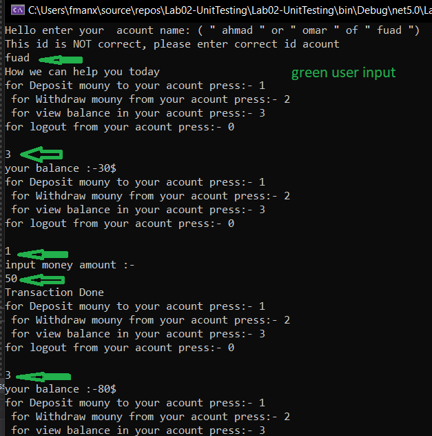
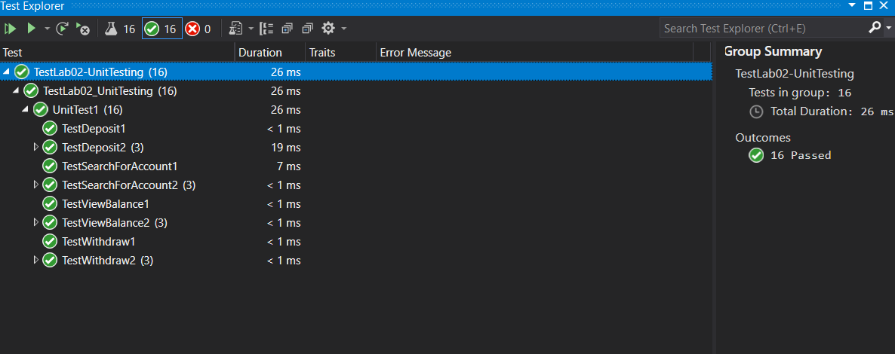

# Lab02-UnitTesting

**Tt is a bank ATM console application, work on C# with code** 
 
### Application summary

it is an ATM Application has some `XUnit`for test his method and it can Deposit, Withdraw and Show Balance for all users in the bank and get the user from his account name.
 

-------

### HOW it works:

when the program starts it shows an interface that gives the user every detail about what the user can do from A -Z

first the user should input his bank account name then the program shows some options what can user do if the user chose  Deposit or Withdraw they should choose the amount of money that they need 
the program has a lot of validation so that will work whatever user input 


-------
**Happy Case**


**Unit test (xUnit)**

------ 


```
**NOTE**
The application doesn't have any connection with database put his system built from arrays have the same length etch array 
have like columns in database so it will be similar to database in his build and that makes the connecting with database in future easer 

the system is a little bit complex but it has comments everywhere.
```